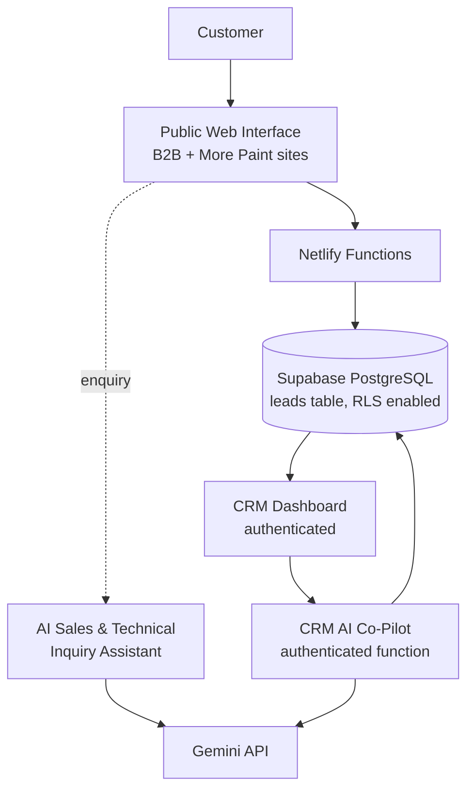

# MOTIS LeadFlow

An AI-assisted lead management and customer enquiry platform, developed for a Nigerian manufacturing business context (Motis Industries Limited — paints, coatings, and industrial chemicals).

---

## Project Overview

MOTIS LeadFlow is a web-based system that connects a customer-facing enquiry experience with an internal sales workflow. It was built for a small manufacturing business whose product enquiries previously arrived through informal channels with no central record, no shared status tracking, and no structured context for follow-up.

The system has three connected parts:

- **Customer-facing functionality** — two public websites (a B2B industrial site and a B2C "More Paint" site), each with a structured enquiry/quote-request form and an embedded **AI Sales & Technical Inquiry Assistant** that answers product and estimation questions and guides customers toward submitting an enquiry.
- **Internal CRM functionality** — an authenticated dashboard where staff review captured leads, inspect lead details, update lead status through a defined lifecycle, view basic analytics, and export data to CSV.
- **AI assistance** — two Gemini-backed workflows (the public inquiry assistant and an internal CRM Co-Pilot), both designed to assist human decision-making rather than replace it.

The project is a practical business system first: AI is applied where it genuinely helps (answering repetitive enquiry questions, summarising leads, drafting responses for human review), not as the centrepiece of the product.

## Business Problem

The operational problem the project addresses is familiar to many small manufacturers:

- Enquiries arrive through ad-hoc channels and are easy to lose or forget.
- There is no central record of who enquired, what they asked for, or what happened next.
- Follow-up depends on individual memory rather than a shared pipeline.
- Staff reviewing an enquiry lack a structured summary of what is known, what is missing, and what to ask next.
- Sales staff repeatedly draft similar follow-up messages by hand.

The system digitises this workflow: enquiries arrive through a structured web form, are stored centrally in PostgreSQL, and flow into a CRM where status can be tracked from `new` through to `won` or `lost`. The AI components reduce repetitive work — answering common customer questions publicly, and giving internal staff a structured first-pass review and editable response draft for each lead.

No claims are made about measured business outcomes (revenue, conversion rate, productivity); the repository contains no such measurements.

## Key Capabilities

### Public enquiry experience
- Customer enquiry / quote-request forms on both public sites (name, phone, location, product selection, and message are required; email and quantity are optional)
- Structured lead capture with server-side validation; the server (never the client) assigns the initial `new` status
- Product/category selection appropriate to each brand
- Enquiry confirmation modal on successful submission
- **AI Sales & Technical Inquiry Assistant** — a multi-turn chat on both sites, grounded in provenance-tagged business data, that helps customers explore products and prepare an enquiry

### CRM
- Authenticated access via a server-side session (single shared staff password)
- Lead list with newest-first ordering, plus brand and status filtering
- Lead detail view (contact details, product, quantity, location, message, status)
- Lead status management restricted to five canonical statuses: `new`, `contacted`, `qualified`, `won`, `lost`
- Lead analytics: totals, won leads, brand distribution, referral-partner counts, and clearly labelled *illustrative* revenue/commission estimates (demo figures, not verified pricing)
- CSV export of the lead list
- Referral partner information derived from an optional referrer field on captured leads

### AI

**1. AI Sales & Technical Inquiry Assistant (public).** A chat interface on both public sites. The assistant answers product and general estimation questions, clearly framed as preliminary guidance: commercial and technical specifics are confirmed by MOTIS staff. Conversation history is multi-turn (bounded), and responses include a call-to-action to submit an enquiry or contact sales via WhatsApp.

**2. CRM AI Co-Pilot (internal, authenticated).** For a selected lead, the Co-Pilot generates exactly five sections:

- Lead summary
- Customer intent
- Missing information (clarification questions)
- Qualification observations
- Suggested response draft

The suggested draft is placed in an editable text area labelled "AI-generated — review before sending". Nothing is sent to a customer automatically; the CRM user reviews, edits, and sends it themselves. The AI is advisory and does not make decisions.

## AI Architecture and Responsible AI Design

- **Server-side access:** all Gemini API calls happen in Netlify Functions. The API key is read from an environment variable and is never present in browser code.
- **Model configuration:** the model is environment-overridable via `GEMINI_MODEL`; the default is `gemini-3.6-flash`.
- **Request validation (public AI endpoint):** request body size is capped (64 KB), message length is capped (2,000 characters), and conversation history must be an array of well-formed `{role: "user"|"model", text}` turns (max 20). Malformed requests are rejected with generic client-facing errors; details are logged server-side only.
- **Rate limiting:** the public AI endpoint applies an in-memory, per-instance sliding-window limiter (~10 requests/minute per client IP, keyed only on Netlify edge-set IP headers).
- **Safe rendering:** model output is HTML-escaped in the browser before any markdown formatting is applied, so model text cannot inject markup. CRM Co-Pilot sections are rendered as plain text.
- **Human-in-the-loop:** the AI assists with enquiry answering, lead interpretation, qualification observations, and response drafting. A human reviews and sends all outgoing communication.

**Business safety boundary.** The AI is explicitly positioned as an assistant, not a chemist, engineer, or manufacturing authority. Its system prompts forbid presenting it as a professional of that kind, forbid inventing technical specifications, and (for the Co-Pilot) forbid any language that authorises manufacturing, formulation, chemical production, or work orders. A lead reaching `won` status is a sales outcome only and never authorises production; the dashboard states this explicitly.

## AI Knowledge / Business Data

The project includes a lightweight, provenance-tagged knowledge layer (`functions/utils/motisKnowledge.js`) used to ground AI responses:

- A single observed MOTIS pricing list (19 entries, recorded from a supplied business artifact) is embedded in the module. Every entry carries `source_type: "business_artifact"` and `verification_status: "observed"`.
- Duplicate product names appearing at different prices in the artifact are preserved exactly as observed; the system does not infer or explain the differences.
- System prompts embed guardrails: general industry knowledge may be explained but never presented as MOTIS-specific fact; any MOTIS-specific value that is not in the observed data (coverage rates, drying times, package sizes, formulation chemistry, regulatory status, availability) must be flagged as requiring confirmation from MOTIS staff.
- No RAG pipeline or vector database is used; the catalogue is small enough that prompt-level grounding with explicit provenance is the appropriate, simpler design.

This is a deliberately conservative approach: pricing is treated as observed business information, never as inferred product specification, and unknown technical facts are routed to humans rather than invented.

## Security

- Server-side CRM authentication: a staff password (environment variable) is exchanged for an HMAC-SHA256-signed session cookie
- Cookie hardening: `HttpOnly`, `Secure`, `SameSite=Strict`, 8-hour expiry
- Timing-safe comparisons for both password and signature checks
- Every protected CRM function independently verifies the session before doing any work
- Restricted CORS for authenticated CRM endpoints (origin allowlist derived from the configured site URL; no origin reflection)
- All secrets (Supabase service key, Gemini API key, CRM password, session secret) live in environment variables and are never committed
- Request-body validation on all endpoints; UUID validation for CRM lead operations; canonical-status validation for lead updates; public lead capture rejects client-supplied status values
- Rate limiting on the public AI endpoint (see above)
- Generic client-facing error messages with server-side logging of details
- Legacy public backup/demo HTML files moved out of the deploy path into `archive/`

This is a hardened small system, not a formally audited one; no penetration-testing or certification claims are made.

## Data and Database Design

Supabase (hosted PostgreSQL) stores the `leads` table. All database access happens server-side through Netlify Functions using the service-role key.

- **Status model:** `new`, `contacted`, `qualified`, `won`, `lost` — constrained at the database level with a CHECK constraint, with the application validating the same set on every read filter and update
- **Status migration:** a defensive migration (`migrations/202609100001_standardize_lead_statuses.sql`) standardises historical status values before applying the constraint, and aborts if unknown values or unexpected permissive policies are found
- **Row Level Security:** RLS is enabled on `leads` with no public policies. Browser clients have no direct database access; the service-role key (which bypasses RLS) is used only inside serverless functions

Schema details are in `supabase_setup.sql` and the migration file referenced above. No credentials or connection strings appear in this repository.

## Architecture



The public sites and the CRM are static files served by Netlify; all dynamic behaviour (lead capture, lead reads/updates, authentication, both AI workflows) runs in Netlify Functions. The Gemini API is reached only from those functions.

## Technology Stack

| Layer | Technology |
|---|---|
| Frontend | HTML, CSS (Tailwind via CDN), vanilla JavaScript |
| Backend | Netlify Functions (Node.js, CommonJS) |
| Database | Supabase (PostgreSQL) with RLS |
| AI | Google Gemini API via `@google/genai` (default model `gemini-3.6-flash`) |
| Testing | Node.js built-in test runner (`node --test`) |
| Tooling | npm, Git / GitHub |

## Project Structure

```
public/                 Static frontend (deployed by Netlify)
  index.html              B2B industrial site: enquiry form + AI assistant
  more-paint.html         More Paint B2C site: enquiry form + AI assistant
  admin/                  CRM dashboard (login, pipeline, analytics, Co-Pilot)
functions/              Netlify serverless functions
  captureLead.js          Public lead intake → Supabase
  getLeads.js             Authenticated lead listing/filtering
  updateLead.js           Authenticated status/notes updates
  crmLogin / crmLogout    Session cookie issue/clear
  crmAuth.js              Session sign/verify helpers
  aiQuoteAssistant.js     Public AI chat endpoint
  crmCoPilot.js           Authenticated CRM AI Co-Pilot endpoint
  leadStatus.js           Canonical status definitions/normalisation
  utils/                  Supabase client, CORS/response helpers,
                          rate limiter, knowledge layer
migrations/             SQL migration (lead status standardisation)
tests/                  10 test files (56 tests)
archive/                Historical design backups (not deployed)
```

## Testing and Validation

Current verified state: **56/56 tests passing** (`npm test`, Node's built-in runner across 10 test files). External services (Supabase, Gemini) are mocked; tests require no credentials or network access.

The test suites cover CRM authentication and endpoint authorisation, lead-status canonicalisation, migration safety checks, public AI endpoint validation and rate limiting, knowledge-layer provenance, CRM Co-Pilot output shape and prompt prohibitions, and static assertions for UX/terminography and sales/production separation.

Validation practices used during development: `npm test`, `node --check` syntax checks on modified JavaScript, `git diff --check`, secrets scanning of tracked files, and explicit verification that protected authentication/migration files remain unchanged. There is no automated CI pipeline in this repository.

## Environment Configuration

| Variable | Required | Purpose |
|---|---|---|
| `SUPABASE_URL` | yes | Supabase project URL |
| `SUPABASE_SECRET_KEY` | yes | Service-role key (server-side only) |
| `GEMINI_API_KEY` | yes | Google Gemini API key (server-side only) |
| `CRM_ADMIN_PASSWORD` | yes | Shared CRM staff password |
| `CRM_SESSION_SECRET` | yes | Random secret used to sign session cookies |
| `GEMINI_MODEL` | no | Overrides the default model (`gemini-3.6-flash`) |
| `URL` / `SITE_URL` | no | Site origin used for CRM CORS allowlisting |

Secrets must be configured in the deployment environment (Netlify site settings) and must never be committed. A template with placeholder values is provided in `.env.template`.

## Local Development

```bash
git clone https://github.com/OlakunleFayemiwo/MOTIS-LeadFlow.git
cd MOTIS-LeadFlow
npm install

# Configure environment variables (names only — see table above):
# copy .env.template to .env and fill in your own values

# Run the full application locally (frontend + functions):
npx netlify dev

# Run the test suite (no credentials required):
npm test
```

The functions require Netlify's local runtime, so the application must be run through `npx netlify dev` (or a deployed Netlify site) — opening the HTML files directly via `file://` will not resolve the `/.netlify/functions/...` routes.

## Deployment

Deployment follows Netlify's standard model, configured in `netlify.toml`:

- The `public/` directory is published as the static site
- The `functions/` directory provides the serverless endpoints
- Environment variables are configured in the Netlify site settings
- Deployment happens by pushing to the connected GitHub repository (no separate CI pipeline exists)

## Production Verification

The following flows were verified during development and release validation:

- Public sites load and render correctly
- Public enquiry form submits and the lead reaches the database
- Captured leads appear in the CRM
- CRM authentication (sign in / sign out / session expiry) works
- Lead status updates work end to end
- Gemini integration works (public assistant and CRM Co-Pilot)

These describe checks performed at release time, not ongoing guarantees. Deployment-time environment configuration (particularly `GEMINI_MODEL` availability and the site URL used for CORS) should be re-verified after any deployment change.

## Design and Product Principles

- **Business-first:** the workflow (capture → review → follow-up → close) drives the design; technology choices follow
- **AI as an assistant:** AI drafts, summarises, and answers questions; humans decide, edit, and send
- **Human review for AI communication:** every AI-generated customer response passes through an editable draft stage
- **Grounded business information:** AI answers are anchored to provenance-tagged observed data
- **Conservative handling of unsupported claims:** unknown technical facts are routed to MOTIS staff rather than invented — including on the static marketing pages, where unverified specification claims were deliberately softened
- **Commercial/manufacturing separation:** a sales outcome never authorises production; the CRM enforces this boundary in both wording and behaviour
- **Clear terminology:** the interface uses ordinary business language an ordinary staff member understands
- **Security by default:** server-side authentication, minimal CORS, validated inputs, and no browser-exposed secrets for internal functionality

## Limitations

- AI responses can be imperfect and always require human review before customer communication
- Rate limiting is in-memory per function instance — useful burst damping, not a globally distributed quota
- The observed pricing data is a single business artifact; it should be verified before any commercial use
- Technical product information shown to customers is indicative and must be confirmed by MOTIS staff
- The CRM uses a single shared password with no per-user accounts, roles, or audit attribution
- The system deliberately does not authorise or trigger manufacturing, formulation, or production work of any kind
- No automated CI/CD pipeline; validation is run manually

## Future Improvements

Labelled as future work, not current capabilities:

- Richer lead analytics (funnel conversion over time, response-time tracking)
- Stronger audit history (per-user accounts and an update trail)
- Role-based CRM permissions
- Improved business knowledge management (a structured ingestion workflow for new observed artifacts)
- Structured product documentation maintained as a data source
- Evaluation datasets for AI response quality
- Monitoring and observability for function errors and AI latency
- Automated deployment testing
- Integration with additional business systems (e.g. invoicing or messaging platforms)

## Project Context / Portfolio Note

This project was developed as a practical exploration of how data, AI, and software engineering can be applied to business operations in a manufacturing context. The work involved identifying a real business workflow (enquiry handling and sales follow-up), translating it into a software system, integrating AI where it provides useful assistance rather than novelty, applying security and data controls appropriate to a small business, and designing the whole system around human decision-making. The implementation evolved iteratively — including deliberate removal of earlier theatrical UI language, unsupported specification claims, and any coupling between sales outcomes and production authority — which reflects the engineering judgement the project was intended to exercise.

## License

No license file is currently present in this repository; no licensing terms are claimed.
